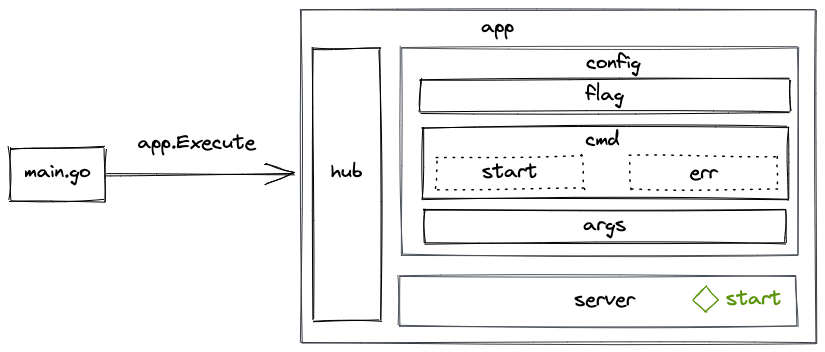
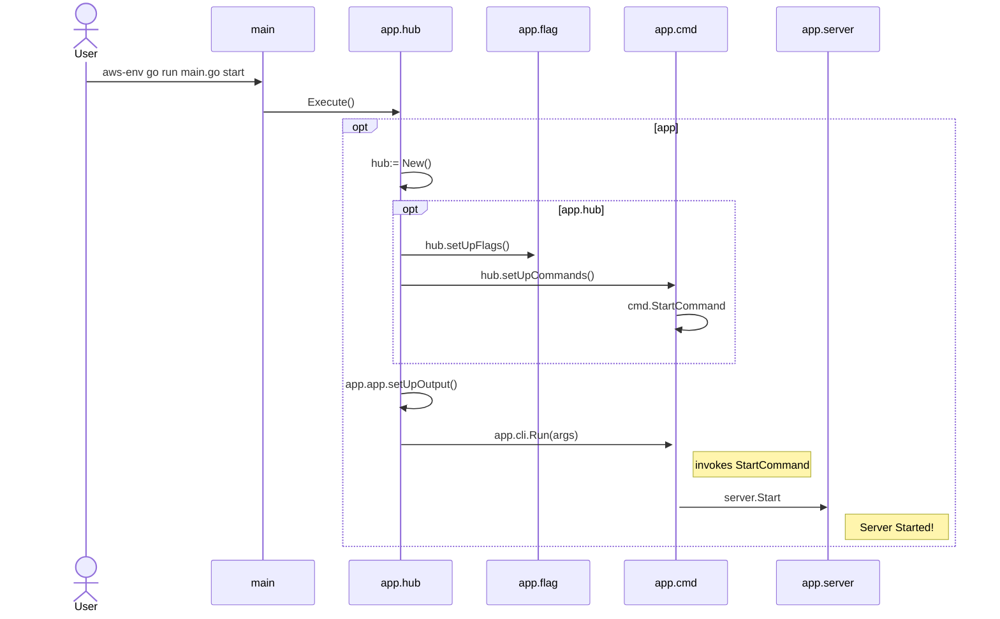

# Key Flows

**[Mermaid Sequence Diagram Reference](https://mermaid-js.github.io/mermaid/#/sequenceDiagram)**


## Starting Server

Open Terminal and execute.

> aws-env is wrapper to aws-vault tool for securely stoding AWS Credentials Locally



```
aws-env go run main.go start
```



Test Execution For the Flow

```
go test -timeout 5s  -coverprofile=coverage/coverage.out  github.com/rajasoun/aws-hub/app/... -v
```

or

Formated Output

```
gotestsum --format testname -- -coverprofile=coverage/coverage.out github.com/rajasoun/aws-hub/app/...
```
