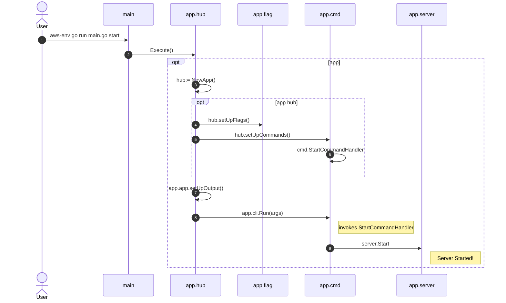

# Key Flows

**[Mermaid Sequence Diagram Reference](https://mermaid-js.github.io/mermaid/#/sequenceDiagram)**


## Starting Server

Open Terminal and execute.
> aws-env is wrapper to aws-vault tool for securely stoding AWS Credentials Locally 

```
aws-env go run main.go start 
```

