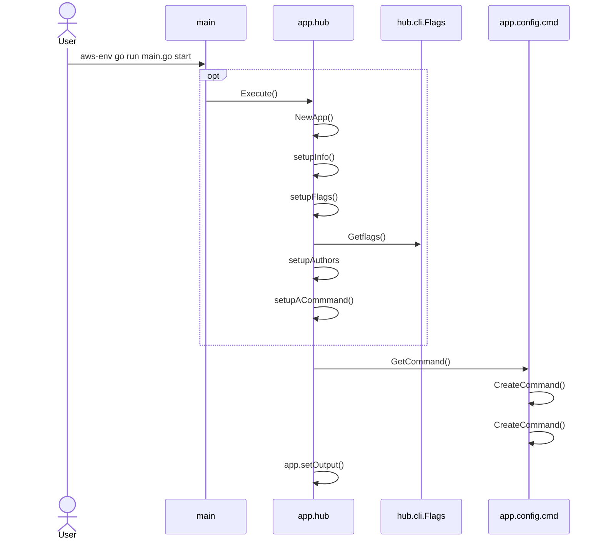

```mermaid

sequenceDiagram
	actor User
		User  ->>  main : aws-env go run main.go start
	opt
			main  ->>  app.hub : Execute()
			app.hub  ->>  app.hub : NewApp()
			app.hub  ->> app.hub : setupInfo()
			app.hub  ->>  app.hub : setupFlags()
			app.hub  ->>  hub.cli.Flags : Getflags()
			app.hub  ->>  app.hub : setupAuthors
			app.hub  ->>  app.hub : setupACommmand()
	end
		app.hub  ->>  app.config.cmd : GetCommand()
		app.config.cmd  ->>  app.config.cmd : CreateCommand()
		app.config.cmd  ->>  app.config.cmd : CreateCommand()
		app.hub  ->>  app.hub : app.setOutput()

```
