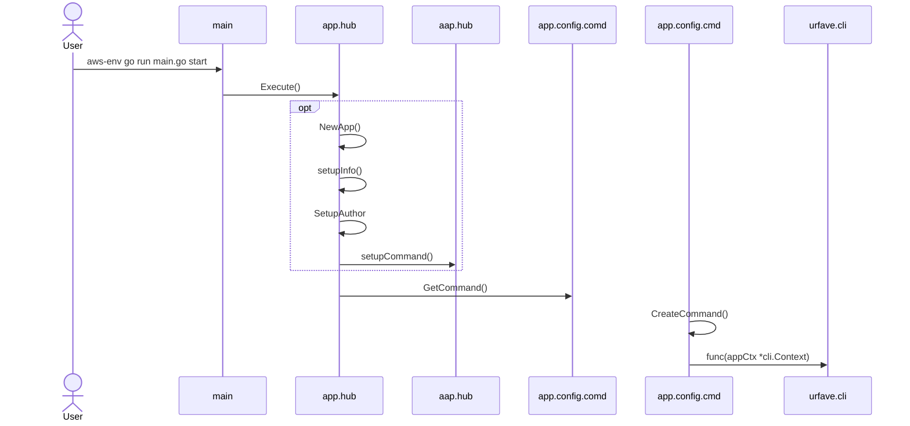

```mermaid

sequenceDiagram
	actor User
 	 	User  ->>  main : aws-env go run main.go start
 	 	main  ->>  app.hub : Execute()
	opt
 		 	app.hub  ->>  app.hub : NewApp()
 		 	app.hub  ->>  app.hub : setupInfo()
 		 	app.hub  ->>  app.hub : SetupAuthor
 		 	app.hub  ->>  aap.hub : setupCommand()
	end
 	 	app.hub  ->>  app.config.comd : GetCommand()
 	 	app.config.cmd  ->>  app.config.cmd : CreateCommand()
 	 	app.config.cmd ->> urfave.cli : func(appCtx *cli.Context)

```
