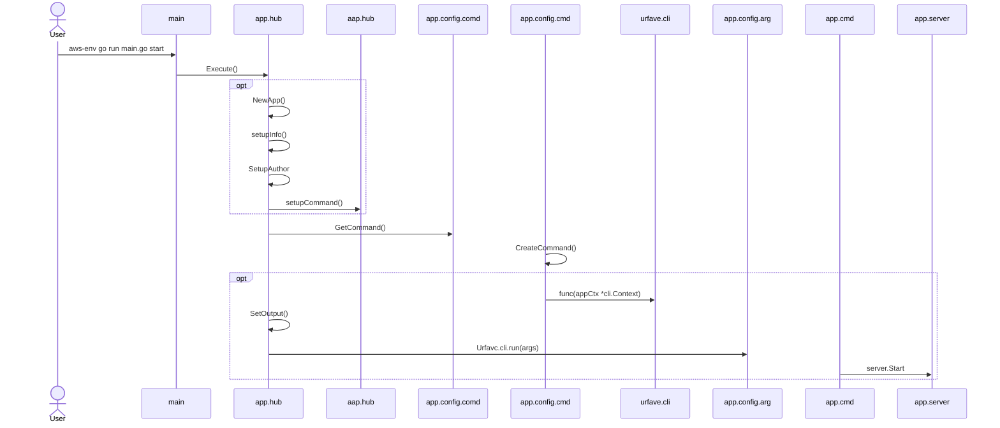

```mermaid

sequenceDiagram
	actor User
 	 	User  ->>  main : aws-env go run main.go start
 	 	main  ->>  app.hub : Execute()
		opt
 		 	app.hub  ->>  app.hub : NewApp()
 		 	app.hub  ->>  app.hub : setupInfo()
 		 	app.hub  ->>  app.hub : SetupAuthor
 		 	app.hub  ->>  aap.hub : setupCommand()
		end
 	 	app.hub  ->>  app.config.comd : GetCommand()
 	 	app.config.cmd  ->>  app.config.cmd : CreateCommand()
	opt
 	 	app.config.cmd ->> urfave.cli : func(appCtx *cli.Context)
 	 	app.hub ->> app.hub : SetOutput()
 	 	app.hub ->> app.config.arg : Urfavc.cli.run(args)
 	 	app.cmd ->> app.server : server.Start
	end

```
