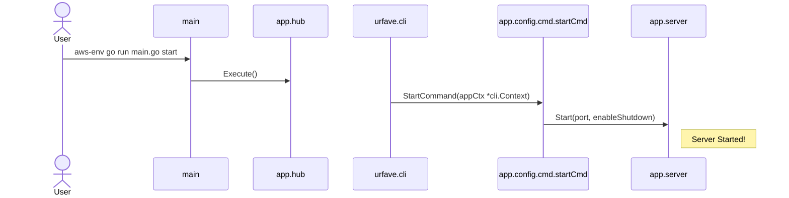

```mermaid

sequenceDiagram
	actor User
		User  ->>  main : aws-env go run main.go start
		main  ->>  app.hub : Execute()
		urfave.cli  ->>  app.config.cmd.startCmd : StartCommand(appCtx *cli.Context)
		app.config.cmd.startCmd  ->>  app.server : Start(port, enableShutdown)
		Note right of app.server: Server Started!

```
